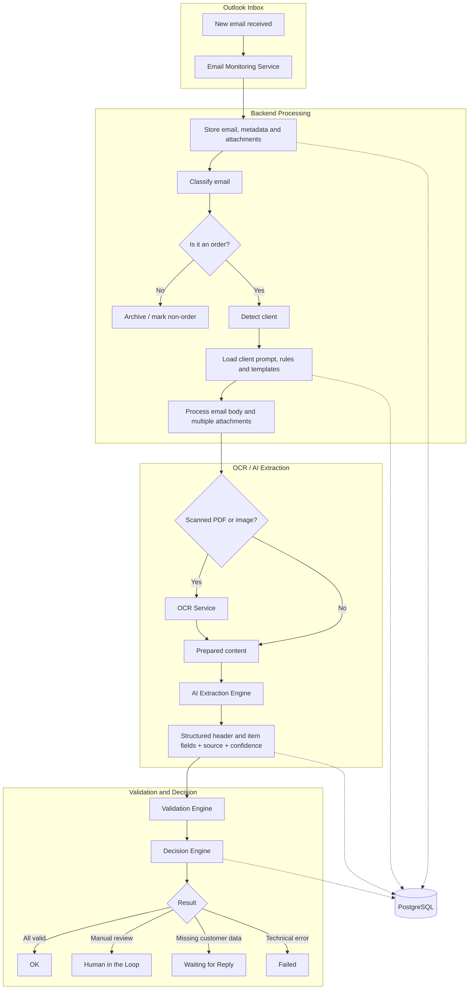
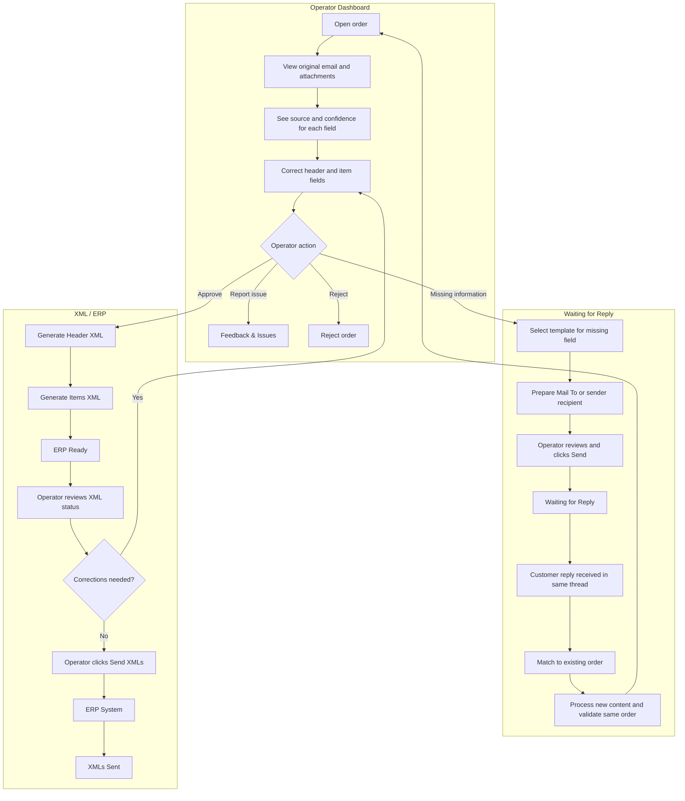
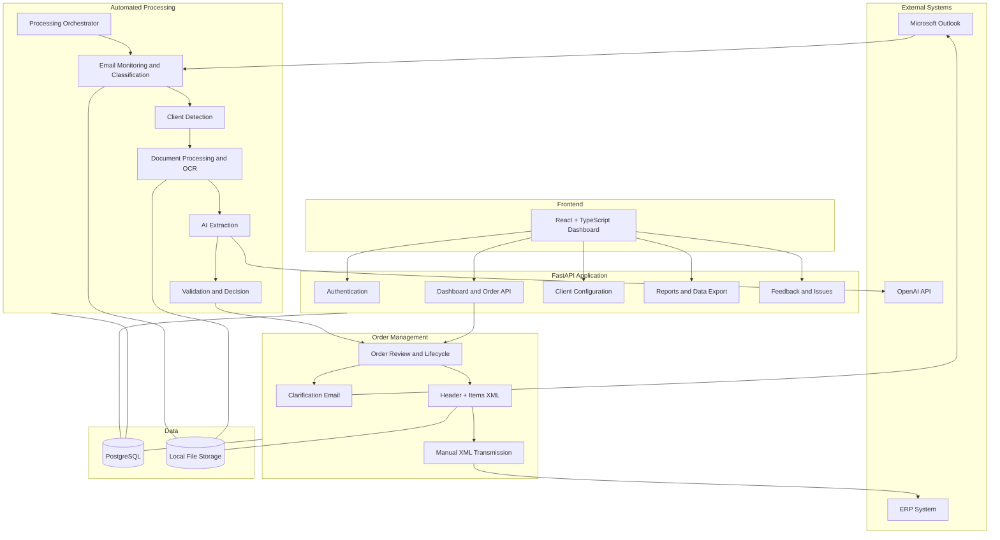
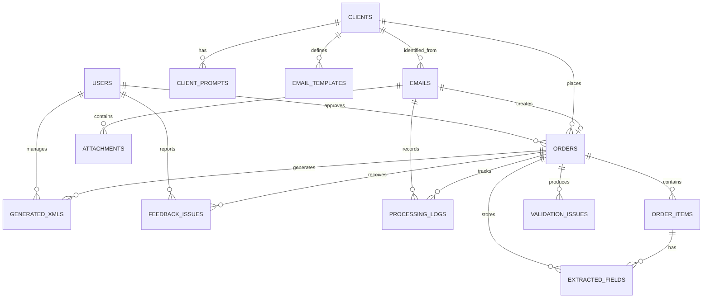
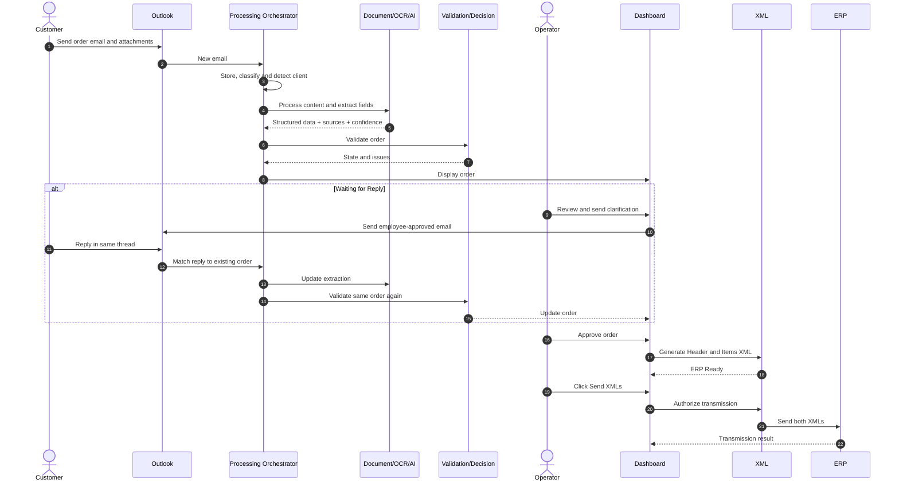
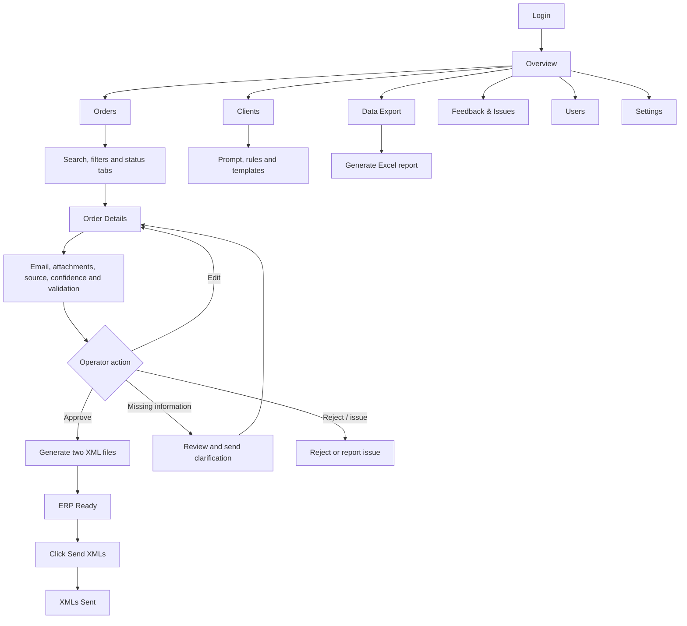

# B2B AI Order Processing Agent — Mermaid Diagram Sources

These editable Mermaid definitions correspond to the visual diagrams included in the Week 2 design document.

## 1A. Automated Order Processing Pipeline

## 1B. Dashboard and Human Review Workflow

## 2. Compact Component Architecture

## 3. Core ER Diagram

## 4. Sequence Diagram

## 5. Dashboard Navigation

